# Create Power Automate Flow for notifications sent by external system to Microsoft Teams channels/group chat

1. Open Power Automate portal https://make.microsoft.com/
   
   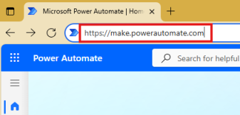

     

2. Select the target environment using the environment picker (top-right).
   
   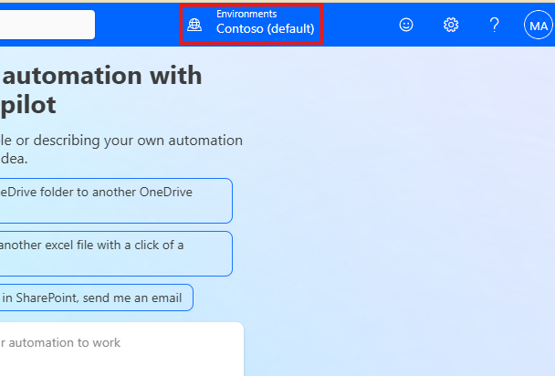

    

3. Click **+ Create** and select **Instant cloud flow**
   
   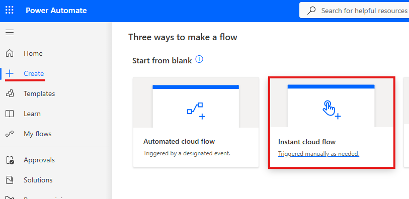

    

4. Provide **Flow name**, scroll down and select the **When a Teams webhook request is received** trigger and then click **Create**
   
   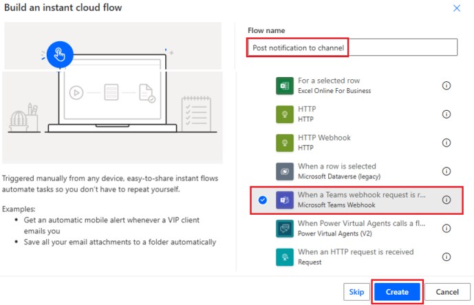

    

5. Configure the trigger by selecting **When a Teams webhook request is received** and define who should be able to trigger the flow 
   - **Anyone** = Anonymous
   - **Any user in my tenant** = All users of Microsoft 365 tenant
   - **Specific users in my tenant** = User of same Microsoft 365 tenant you define. List of email addresses
  
      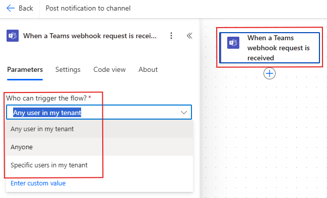

       

6. Add new action by clicking **(+)** under the flow trigger
   
   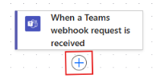

    

7. Search and select **Post a message in a chat or channel** action
   
   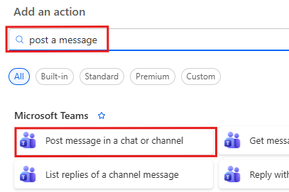

    

8. Select do you want to post a message either as **Flow bot** or **User**
   
   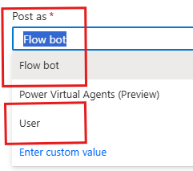

    

   - If you select **Flow bot**, then message will show like below in Teams channel
  
      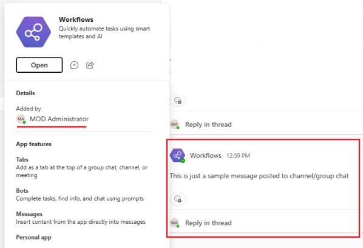

       
   
   - When using User option then messages are seen similarly if user posted message to channel in Microsoft Teams
  
      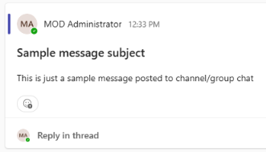

       

9. Select do you want to post a message to either **Channel** or **Group chat**
    
   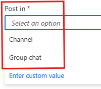

    

10. Define team and channel or group chat depending which option you selected in the previous step
    
       - **Team and Channel**

          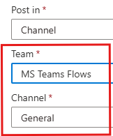

           

       - **Group chat**

          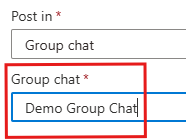

           

11. Type-in message and if you want you can also set subject (only available when posting as User) for the message
    
    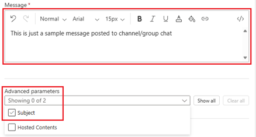

     

    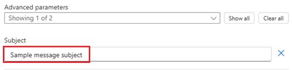

     

12. Publish the flow
    
    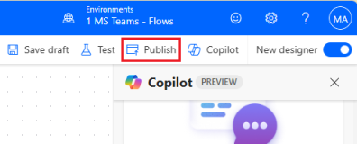

     

13. Select the flow trigger and copy **HTTP URL** generated for the flow. This URL can be used to call (run) the flow e.g. from external system

    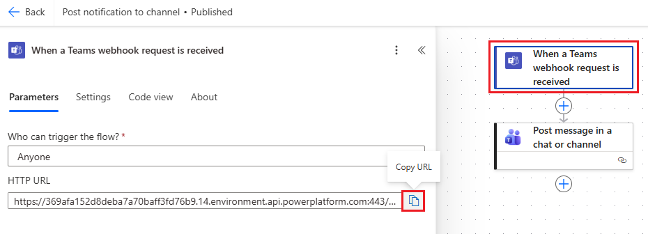

      